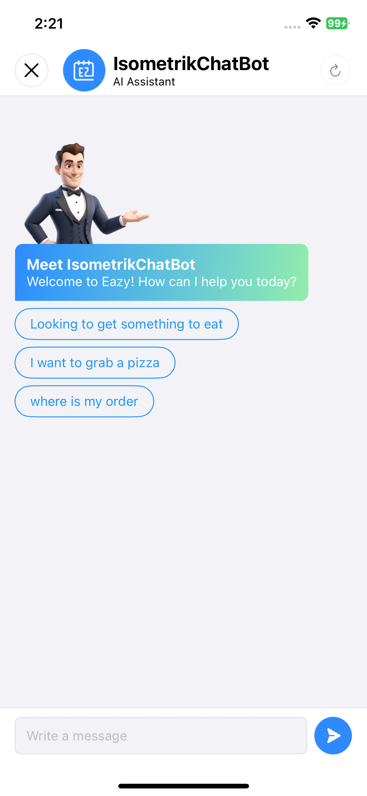
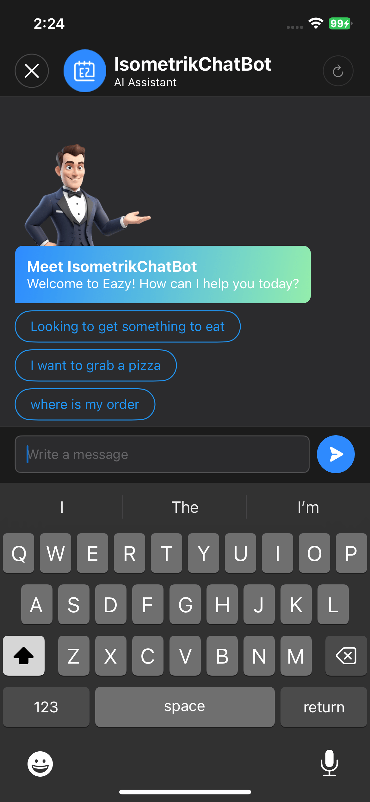

<p align="center">
  <a href="https://www.swift.org/package-manager/"></a>
  <a href="https://getstream.io/chat/docs/sdk/ios/"></a>
  <a href="https://swift.org"></a>
</p>

# Isometrik ChatBot SDK

The **Isometrik ChatBot SDK** enables seamless customer support interactions, allowing users to resolve queries related to products and orders. Customers can easily inquire about order statuses, details, or search for top restaurant recommendations based on their location.

## Setup

### 1. Prepare Your Keys
To integrate the SDK, ensure you have the following credentials ready:
- `chatBotId`
- `userId`
- `licenseKey`
- `appSecret`
- `storeCategoryId`

### 2. Initialize the SDK

- First, create an instance of `AppConfigurationManager` using your credentials:

```swift
let appConfig = AppConfigurationManager(
    chatBotId: "YOUR CHAT BOT ID",
    userId: "YOUR USER ID",
    appSecret: "YOUR APP SECRET ID",
    licenseKey: "YOUR LICENSE KEY",
    storeCategoryId: "YOUR STORE CATEGORY ID"
)
```

- Next, pass this object to ``LaunchViewModel`` and then to the ``LaunchView``

``` swift

let launchViewModel = LaunchViewModel(appConfigurations: appConfig)
let launchView = LaunchView(viewModel: launchViewModel)

```
- Finally, present the chat bot using ``UIHostingViewController``:

``` swift

let hostingController = UIHostingController(rootView: launchView)
hostingController.modalPresentationStyle = .fullScreen
self.present(hostingController, animated: true, completion: nil)

```

### Quick links
- [How to handle delegates](./Readme_doc/external_delegate.md) : Learn how to use the external delegate to manage actions suggested by the ChatBot.


### App Images

<table>
<tr>
<td>
<p>Description 1</p>

</td>
<td>
<p>Description 2</p>

</td>
</tr>
</table>


